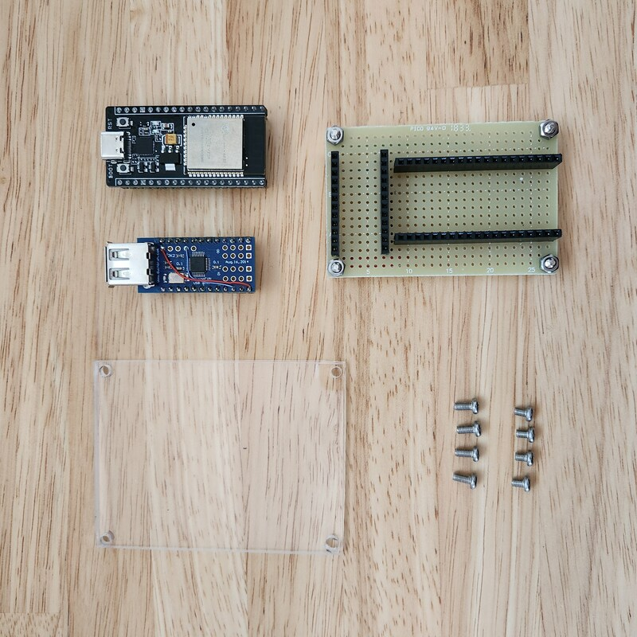
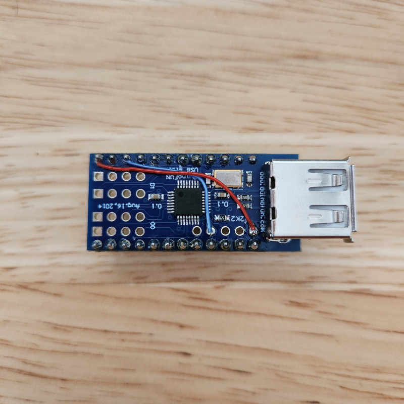
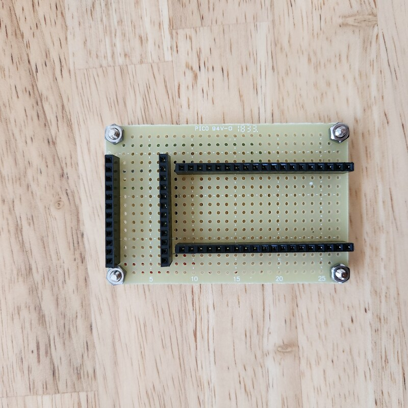
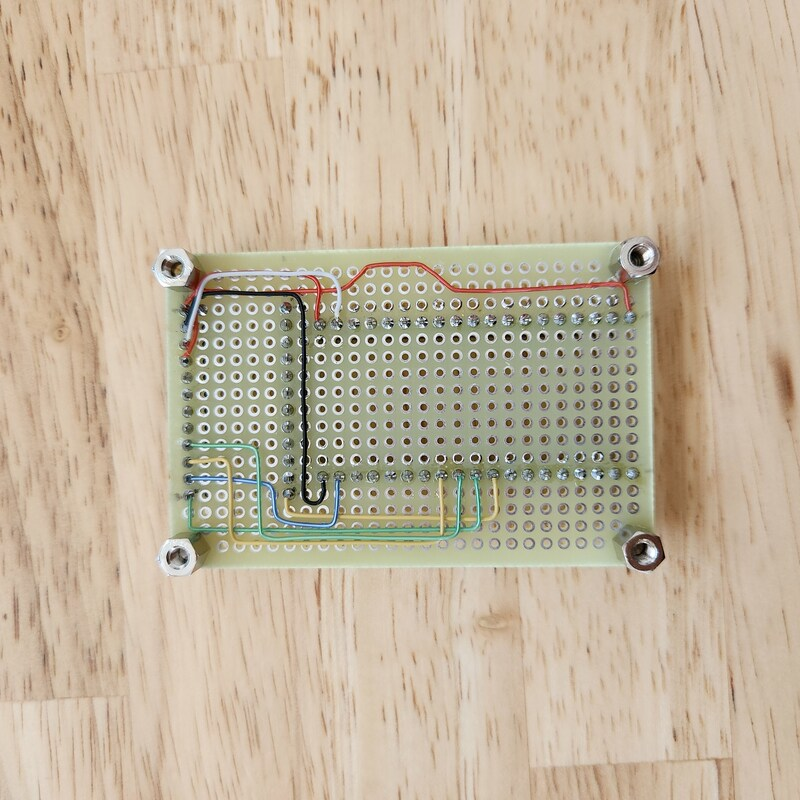
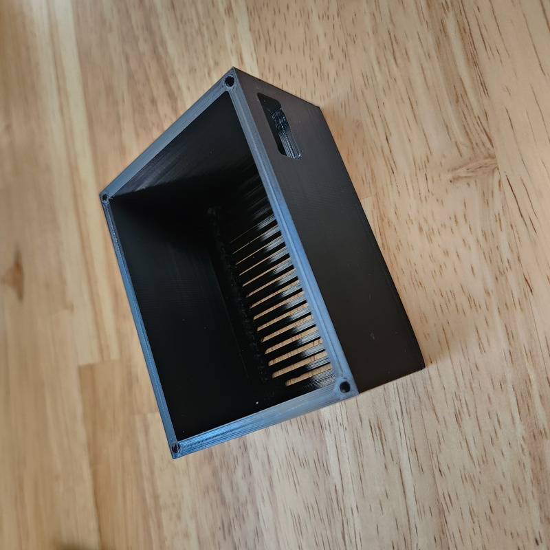
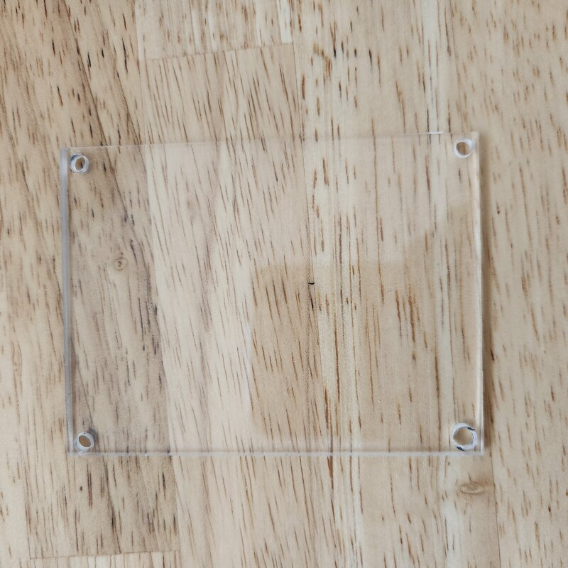
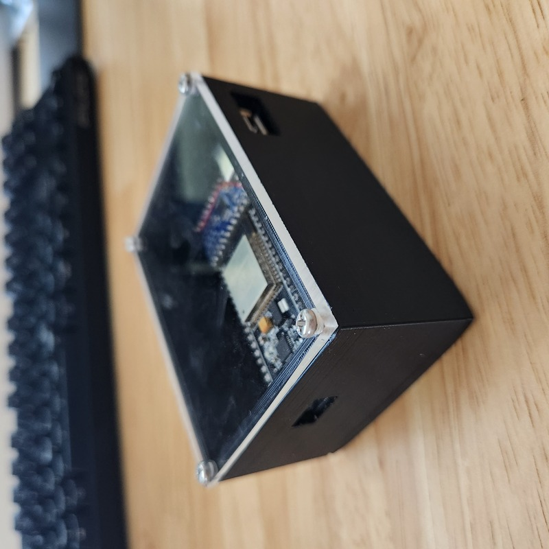

# M5PaperMultiDimmerSwitch
[](https://github.com/Ry0/KeyboardMultiDimmerSwitch/actions/workflows/build-test.yaml)


Multiple programmable switches for HomeKit using ESP32 Development Board and USB keyboard.
 
## DEMO


# Features

* You can define many buttons by preparing your favorite keyboard.
* The device alone can work as a HomeKit accessory. (No need for Homebridge, etc.)
* Supports single tap only. Double tap and long press are not supported.

## Hardware

|  Item  |  Link  |
| :---- | :---- |
|  ESP32 Development Board (ESP32-CP2102-TYPE C) |  https://ja.aliexpress.com/item/32959541446.html  |
|  Mini USB Host Shield 2.0 ADK SLR development tool |  https://ja.aliexpress.com/item/32881871223.htm   |
|  Portable Mini 8 Keys Keypad |  https://ja.aliexpress.com/item/1005002715921298.html   |
|  Single-sided glass/universal substrate |  https://akizukidenshi.com/catalog/g/gP-00517/   |
|  Pin socket 19pin x2, 12pin x2 | https://akizukidenshi.com/catalog/g/gC-08979/ |
|  Hexagonal spacer x4 | https://akizukidenshi.com/catalog/g/gP-07471/ |
|  M3 304 Stainless Steel Round Head Cross Screw |   https://ja.aliexpress.com/item/1005004949292330.html  |  
|  Case |  https://www.thingiverse.com/thing:5916988 | 
| Cover（acrylic panel） | https://www.amazon.co.jp/dp/B09M6SRPK3 | 




### Mini USB Host Shield
For Mini USB Host Shield, please refer to the following URL for modification.
* https://okiraku-camera.tokyo/blog/?p=8092
* https://okiraku-camera.tokyo/blog/?p=8333



### Build of connector base
Please refer to the following link to create the connector base.
https://ht-deko.com/arduino/shield_usbhost_mini.html





### Case
Use the link below to print the case on your 3D printer.
https://www.thingiverse.com/thing:5916988



If necessary, you use acrylic panels to make the cover.



### Assembling result




## Software
### Installation

```
cd <your workspace>
git clone https://github.com/Ry0/KeyboardMultiDimmerSwitch.git
cd KeyboardMultiDimmerSwitch
```

Change your Wifi SSID and password(`src/wifi_info.h`).

```cpp
#ifndef _WIFI_INFO_H_
#define _WIFI_INFO_H_

const char *ssid = "ssid";
const char *password = "password";

#endif
```

Build it by the PlatformIO.
 
## Usage
 

 
## License
 
KeyboardMultiDimmerSwitch is under [GPL license](./LICENSE)
